# Spring Boot

La idea del ejercicio es exponer servicios REST en JAVA por medio de los cuales se pueda registrar una factura junto con
sus ítems, debido a que no se realizará Front para este ejercicio, se listarán los servicios a realizar.

- Registrar datos del cliente en la tabla CLIENTE
- Registrar datos en la tabla PRODUCTO
- Registrar datos en la tabla FACTURA
- Registrar datos en la tabla DETALLE
- Consulta de clientes del sistema
- Consulta de productos del sistema
- Consulta de facturas por ID_CLIENTE
- Consulta del detalle de factura por ID_FACTURA

## Solution

- ### [Postman Collection file](SmartSoft.postman_collection.json)

- ### [ER Diagram Model file for MySQL WorkBench](ER_diagram.mwb)

- ### Table ER Diagram

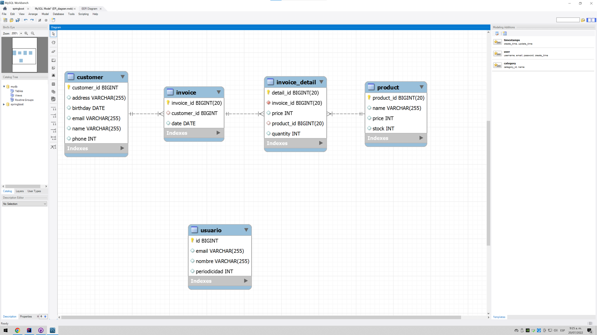

- ### Table Schema

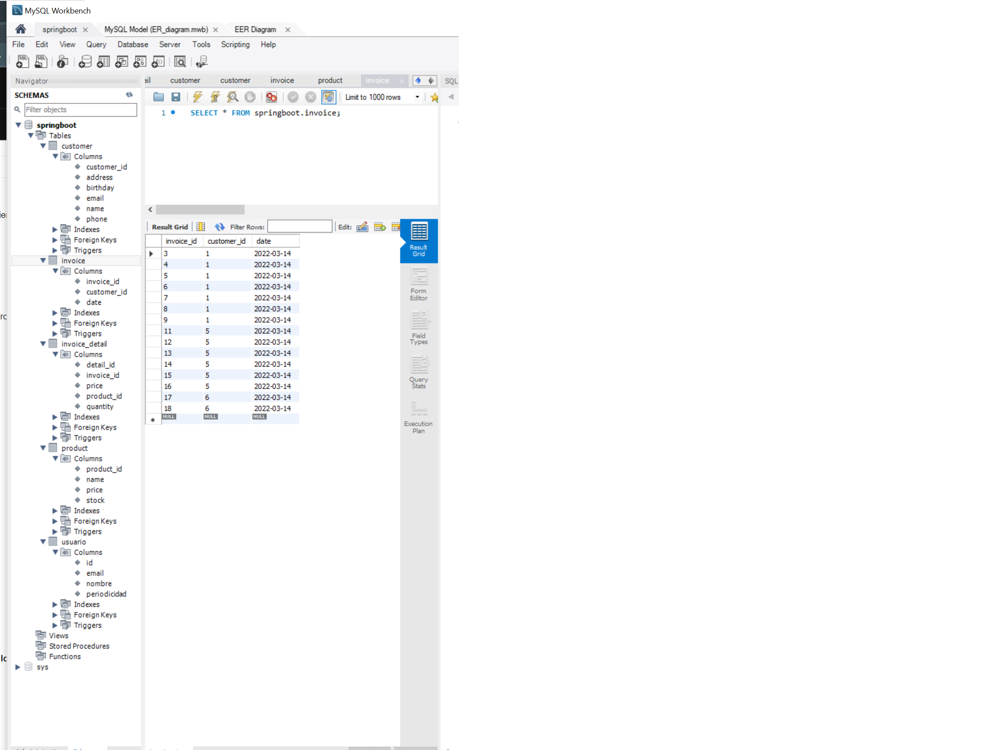

- ### Spring Boot Application

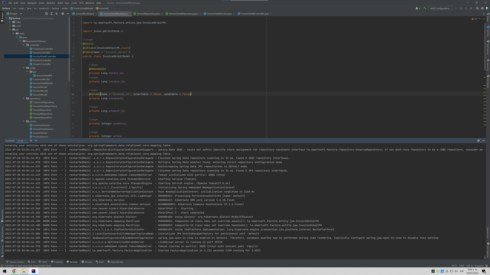

- ### Dummy Entity CRUD (Spanish)

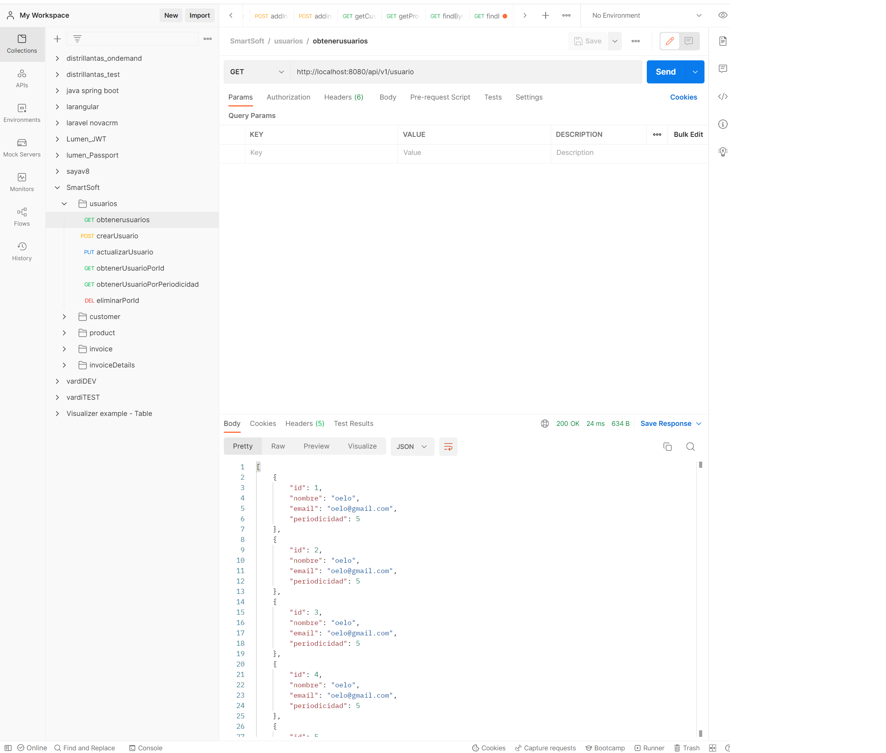

- ### Register customer data

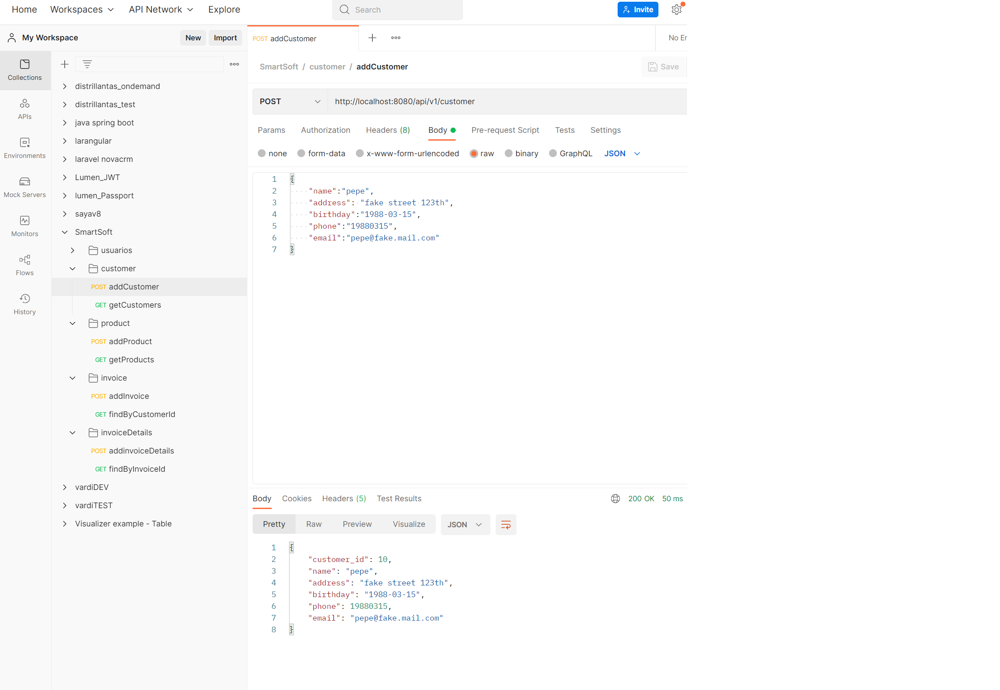

- ### Register product data

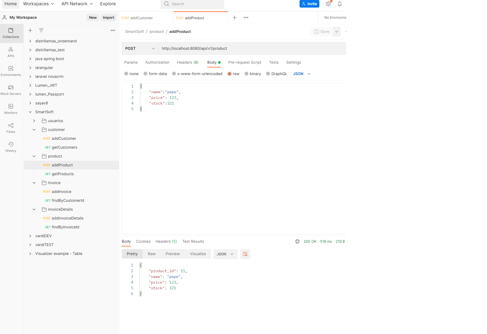

- ### Register invoice data

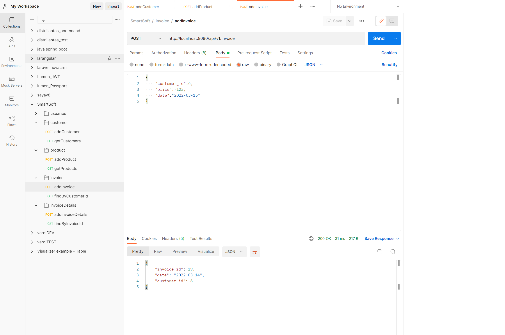

- ### Register invoice's detail data

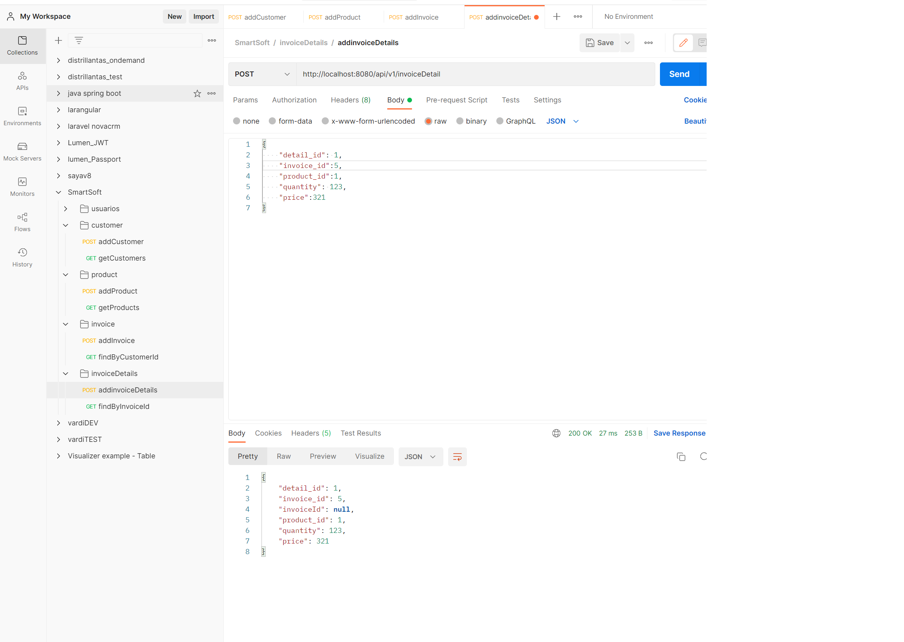

- ### Get all customers

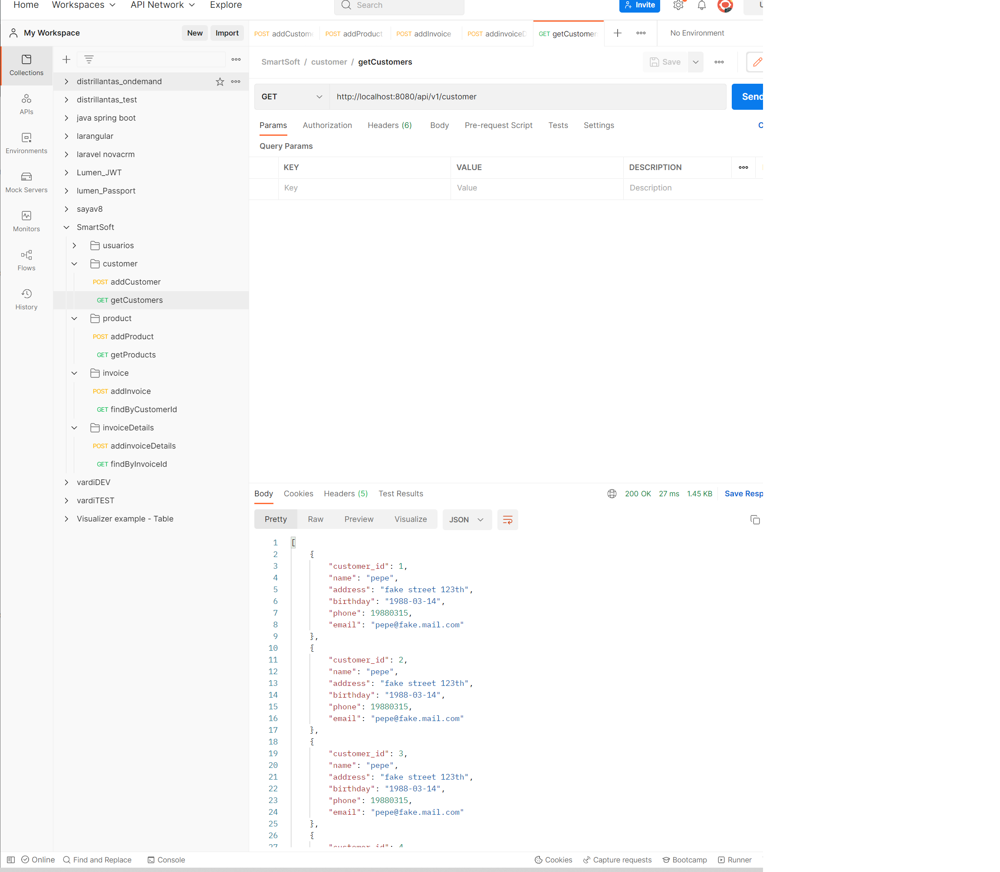

- ### Get all products

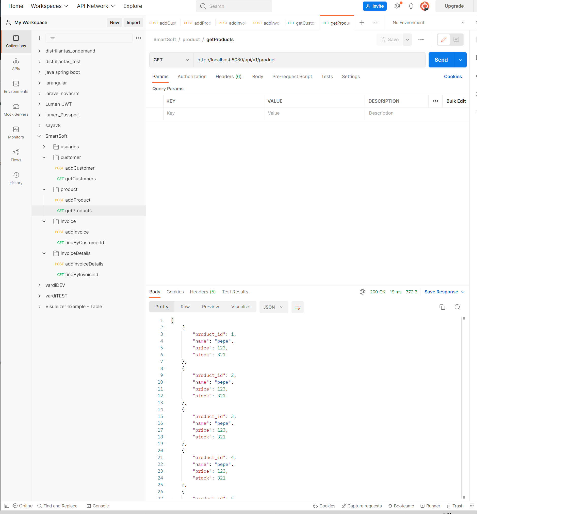

- ### Get all invoices by customer's id

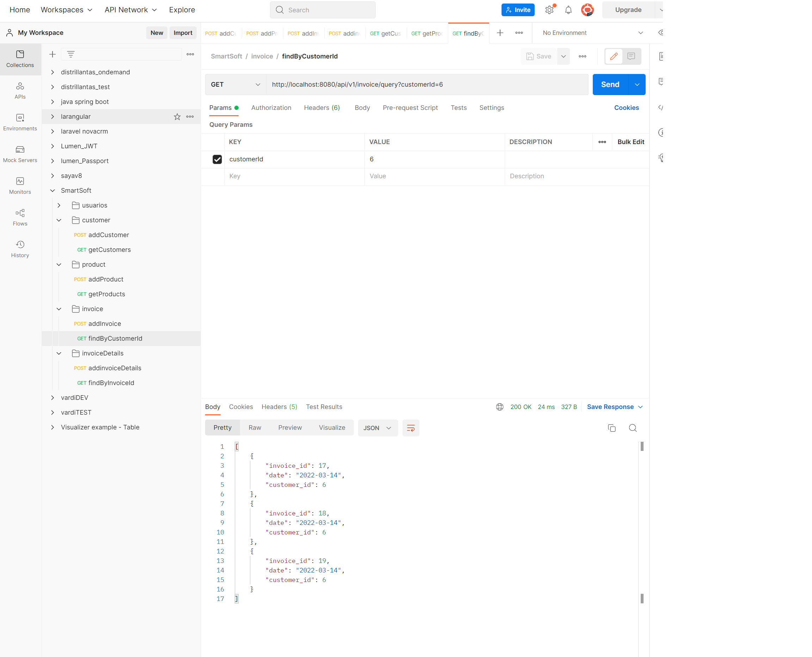

- ### Get all invoice's details by invoice id

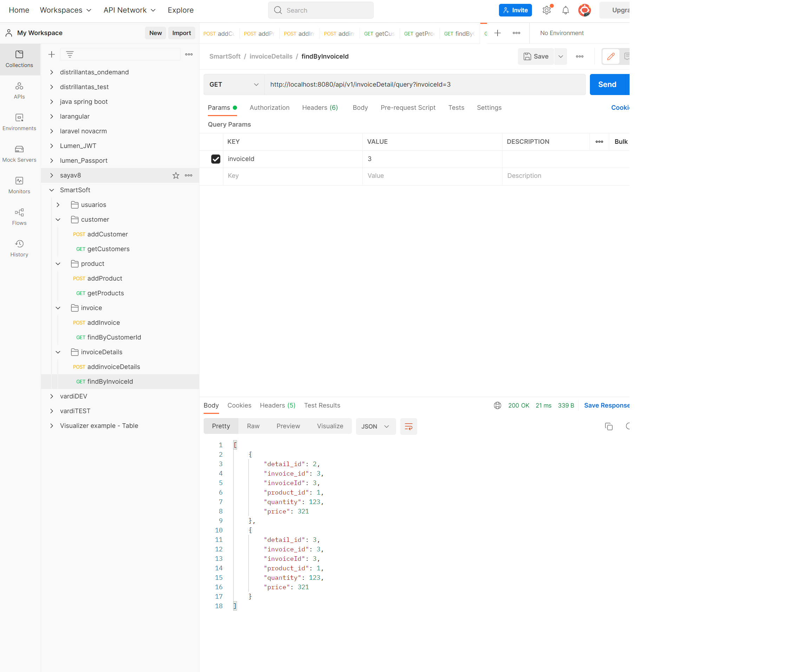
