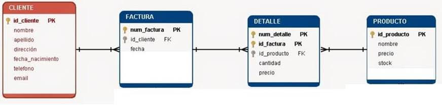

# smartsoft_springboot
 smartsoft_springboot
 La idea del ejercicio es exponer servicios REST en JAVA por medio de los cuales se pueda registrar una factura junto con sus ítems, debido a que no se realizará Front para este ejercicio, se listarán los servicios a realizar.

- Registrar datos del cliente en la tabla CLIENTE
- Registrar datos en la tabla PRODUCTO
- Registrar datos en la tabla FACTURA
- Registrar datos en  la tabla DETALLE
- Consulta de clientes del sistema
- Consulta de productos del sistema
- Consulta de facturas por ID_CLIENTE
- Consulta del detalle de factura por ID_FACTURA

